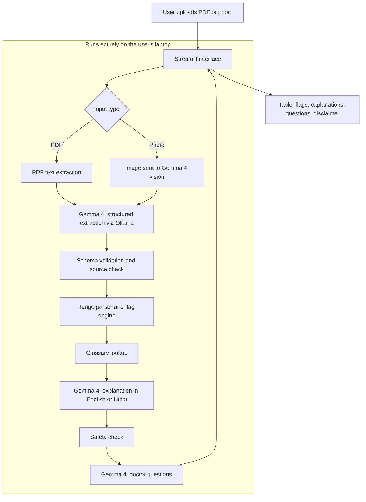
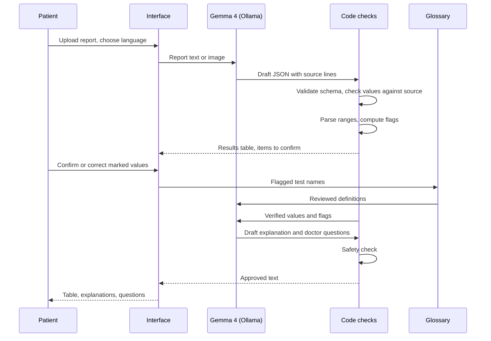

# ReportWise Local

**Understand your lab report in plain language, without it ever leaving your laptop. Built on Gemma 4.**

Hacktober Fest Open Source AI Hackathon | Qualifier Submission | Track: Best Use of Gemma 4

Team: PACERS | Members: Pallav Sharma, Som Moghe, Anish Adhal, Chaitanya Rakhunde

---

## Table of Contents

1. [Project Name](#1-project-name)
2. [Problem Statement](#2-problem-statement)
3. [Project Overview](#3-project-overview)
4. [Proposed Solution](#4-proposed-solution)
5. [Objectives](#5-objectives)
6. [Target Users / Use Case](#6-target-users--use-case)
7. [Open-Source AI Technology Selected](#7-open-source-ai-technology-selected)
8. [Why This Technology Was Selected](#8-why-this-technology-was-selected)
9. [AI's Role in the System](#9-ais-role-in-the-system)
10. [System Architecture](#10-system-architecture)
11. [Component-Level Architecture](#11-component-level-architecture)
12. [Data / Information Flow](#12-data--information-flow)
13. [Agentic Workflow](#13-agentic-workflow)
14. [Technology Stack](#14-technology-stack)
15. [Expected Features](#15-expected-features)
16. [Implementation Approach](#16-implementation-approach)
17. [Expected Final Output](#17-expected-final-output)
18. [Future Scope / Scalability](#18-future-scope--scalability)
19. [Open-Source Dependencies / Components](#19-open-source-dependencies--components)
20. [Expected Challenges and Mitigation](#20-expected-challenges-and-mitigation)

---

## 1. Project Name

**ReportWise Local**

The name says what it does: help a person get wise about their own report, and keep everything on their own machine. The repository name is `reportwise-local`.

---

## 2. Problem Statement

A lab report is written for doctors, not for the person it belongs to. It is full of abbreviations (MCV, SGPT, HbA1c), numbers with ranges, and a few values marked high or low. The doctor's appointment is often days away, so the patient spends that time worrying or searching online.

The common shortcut is pasting the report into a cloud chatbot. That creates two problems:

- **Privacy.** A report contains a name, age, test history and sometimes an ID or phone number. Uploading it to someone else's server is a risk most people do not think about.
- **Reliability.** A general chatbot can get a number wrong, make up a reference range, or start telling the patient what disease they have. In a medical setting, a confident wrong answer is worse than no answer.

There is also a language gap. Most people receive reports in English but think and talk about health in Hindi or Marathi.

---

## 3. Project Overview

ReportWise Local is a local web application. The user uploads a lab report as a PDF or a clear photo. The app extracts each test with its value, unit and reference range, shows them in a table, marks what is outside the printed range, and explains the results in plain English or Hindi. It also suggests a few questions to ask the doctor.

The design rule behind the whole project:

> **The model explains. Code decides.**

Gemma 4 reads the report and writes the explanations. It never decides whether a value is high or low, and it never supplies a reference range. Those come from the report itself and from simple, readable code. This keeps the tool useful without letting it become a source of medical misinformation.

It is strictly an understanding tool. It does not diagnose, does not suggest treatment or medicine, and does not replace a doctor.

---

## 4. Proposed Solution

The system works in four steps:

1. **Read.** Text is taken from a PDF directly. For a photo, Gemma 4's vision input reads the image.
2. **Extract.** Gemma 4 fills a fixed JSON schema: test name, value, unit, reference range, and the source line it came from. Output that does not match the schema is rejected and retried.
3. **Check and flag.** Code verifies that each value appears in the source text (for PDFs), parses the printed reference range, and marks the result Low, Normal or High.
4. **Explain.** Gemma 4 rewrites a reviewed glossary definition and the verified result into short, simple language, in the language the user selects. The explanation passes a safety check before it is shown.

---

## 5. Objectives

- Let a patient understand the main points of a report in a couple of minutes.
- Keep all processing on the user's machine, with no network calls while the app is in use.
- Make every number traceable to the exact line in the original report.
- Keep numbers and High/Low flags identical in every language. Only the explanation text is translated.
- Support English and Hindi in the first version.
- Stay non-diagnostic, with safeguards enforced in code and not only requested in a prompt.
- Run on ordinary laptops with 4 to 8 GB of GPU memory using small Gemma 4 variants.

---

## 6. Target Users / Use Case

**Primary users**

- Patients and family members who receive a lab report and want to understand it.
- Caregivers handling the reports of elderly parents who are more comfortable in Hindi.

**Typical use case**

A person receives a blood test as a PDF. They open ReportWise Local, upload it, and choose Hindi. In about a minute they see a table of their results with flagged values, a short plain-language note on each flagged test, and three or four questions to take to the doctor. Nothing was uploaded anywhere.

**Initial scope of supported reports**

Routine panels only: Complete Blood Count, Liver Function, Kidney Function, Lipid Profile, Blood Sugar / HbA1c and Thyroid Profile. Limiting the scope lets us test accuracy properly instead of claiming to handle everything.

---

## 7. Open-Source AI Technology Selected

| Component | Role |
|---|---|
| **Gemma 4 (E4B)** | Main model: structured extraction from text and images, plain-language explanation, translation to Hindi, question generation |
| **Gemma 4 (E2B)** | Lighter fallback for laptops with less GPU memory |
| **Ollama** | Local runtime with JSON-schema constrained output |

---

## 8. Why This Technology Was Selected

**Why an open-weight model.** The whole point is that the report stays on the device. A hosted API cannot offer that. A model running locally can, and the privacy claim becomes a property of the architecture and not a line in a policy.

**Why Gemma 4.**

- It accepts both text and images, so one model handles reading a photographed report and writing the explanation, with no need to chain separate vision and language models.
- It has small variants (E2B and E4B) meant for consumer hardware. Our four laptops have 4 to 8 GB of GPU memory, so larger variants are out of reach and the small ones are a real fit.
- It supports many languages, which we need for Hindi. We will test its Hindi output on medical text early in the final, and if the quality is poor we will say so and fall back to English.

**Why Ollama.** It runs well on a single consumer GPU, has a simple local API, and supports JSON-schema constrained output, which our extraction step depends on.

**Why a curated glossary instead of asking the model to define terms.** A model defining a medical test from memory is usually right, but "usually" is not good enough here. We keep a small reviewed glossary and let Gemma only rephrase what is in it. The facts come from the glossary and the wording comes from the model.

---

## 9. AI's Role in the System

**What Gemma 4 does**

1. **Structured extraction.** Reads the report (text or image) and fills the JSON schema.
2. **Plain-language explanation.** Rewrites the glossary definition and the verified result in simple words.
3. **Translation.** Produces the Hindi version from the grounded English explanation.
4. **Question generation.** Drafts three to four questions for the doctor, based only on the flagged findings.

**What Gemma 4 does not do**

- It does not decide whether a value is high, low or normal. A rule engine does.
- It does not provide reference ranges. They are taken from the report.
- It does not diagnose, name likely diseases, or suggest medicines or treatment.
- It cannot introduce new numbers. Any number in generated text that is not in the verified data causes the text to be rejected.

---

## 10. System Architecture

There are no outbound network calls while the app is being used. Models are downloaded once during setup.

---

## 11. Component-Level Architecture

| Component | Responsibility | Input | Output |
|---|---|---|---|
| **Input handler** | Detect PDF or image, pull text from PDFs | Uploaded file | Page text or page images |
| **Extractor (Gemma 4)** | Fill the report schema with constrained JSON output | Text or images | Draft structured results |
| **Validator** | Check the schema, and for PDFs check that each value appears in the source text | Draft results | Verified results plus "please confirm" items |
| **Range parser and flag engine** | Read the printed reference range and compare the value | Verified results | Low / Normal / High, or "range not readable" |
| **Glossary** | Reviewed plain-language definitions for common tests | Test name | Definition text |
| **Explainer (Gemma 4)** | Rephrase the definition and result in simple words, in the chosen language | Flags, definitions, language | Short explanation per flagged test |
| **Safety check** | Reject text that sounds like diagnosis or treatment, or has numbers not in the verified data | Generated text | Approved text, or a retry request |
| **Question generator (Gemma 4)** | Draft questions for the doctor | Flagged findings | Three to four questions |
| **Interface (Streamlit)** | Upload, language choice, results table, source line view | User actions | Rendered report |

The range parser handles the common printed forms such as `13.0 - 17.0`, `< 200`, `> 40` and `up to 5.7`. Anything it cannot read is shown as "range not readable" and is never guessed.

---

## 12. Data / Information Flow

**Data handling**

- Uploaded files are kept in memory or a temporary local folder and are deleted when the session ends.
- Nothing is saved unless the user chooses to.
- No analytics, telemetry or external API calls.

---

## 13. Agentic Workflow

This is a small fixed pipeline with a few decision points, not a free-roaming agent. In a medical setting, predictable behaviour matters more than flexibility.

1. **Retry on bad structure.** If Gemma's output fails schema validation, the pipeline retries with the specific error, up to two times.
2. **Mark uncertain values.** If a value from a PDF cannot be found in the source text, or a photo-based value looks unusual, it is marked "please confirm" and shown with its source line.
3. **Regenerate on safety failure.** If the safety check rejects an explanation, it is regenerated with a stricter instruction. After two failures, the app shows the plain glossary text instead.
4. **Model fallback.** On a machine that cannot load E4B, the app uses E2B and tells the user.

---

## 14. Technology Stack

| Layer | Choice |
|---|---|
| Language | Python 3 |
| Model runtime | Ollama |
| Models | Gemma 4 E4B, Gemma 4 E2B |
| PDF handling | PyMuPDF |
| Schema validation | Pydantic |
| Glossary | A reviewed JSON file |
| Interface | Streamlit, with a bundled Devanagari font (Noto Sans Devanagari) |
| Setup | One setup script and a pinned requirements file |

---

## 15. Expected Features

**Committed (will be working in the final demo)**

- Upload a text-based PDF lab report, or a clear photo as an additional input.
- Gemma 4 extraction of tests, values, units and reference ranges into a table.
- Source line shown for every value.
- "Please confirm" prompts for values the system is unsure about.
- Rule-based Low / Normal / High flags computed by code.
- Plain-language explanation for each flagged test and a short overall summary.
- Glossary of common tests and terms with simple definitions.
- English and Hindi output, with the English medical term shown next to the Hindi explanation.
- Doctor discussion guide with three to four questions.
- Safety check and a visible disclaimer in both languages.
- Fully offline operation.

**Stretch (only if the core is stable)**

- Marathi output, after a native speaker reviews the glossary and sample output.
- Offline audio playback of explanations.
- Comparison of two reports from the same person.

**Explicit limitations**

- Not diagnostic. No disease prediction, no treatment, medicine or dosage suggestions.
- No interpretation of X-ray, MRI, CT or other medical images. This is excluded deliberately because model interpretation of such images is unreliable and errors carry high risk.
- Routine panels only in the first version. Tests that are not in the glossary are shown with their values and flags but without an explanation.
- Photo input works best on clear, well-lit, upright pages. Because the value cannot be checked against embedded text, all photo-based values are shown for the user to confirm.

---

## 16. Implementation Approach

The final is a single day, and our plan is to build the core in about five to six hours. Each stage works on its own so we can stop adding features when time runs short.

**Preparation before the final (kept outside this repository)**

- A handful of sample reports covering the supported panels, with personal details removed or fabricated.
- A starter glossary of 30 to 50 common tests with plain-language definitions in English and Hindi.
- A check of which Gemma 4 variant runs best on each team laptop.

**Build plan**

| Time | Work | Result |
|---|---|---|
| Hour 0 to 1 | Install Ollama and Gemma 4 on all laptops, define the extraction schema, first extraction call on a sample PDF | A report goes in, JSON comes out |
| Hour 1 to 2 | Validator, source-line check, range parser and flag engine | Values verified and flagged by code |
| Hour 2 to 3 | Glossary lookup, explanation prompt, safety check | Grounded explanations in English |
| Hour 3 to 4 | Streamlit interface, Hindi output and font, source line view | Full flow in the browser |
| Hour 4 to 5 | Doctor questions, photo input path, disclaimer, error handling | Complete core feature set |
| Hour 5 to 6 | Testing on all sample reports, bug fixes, demo rehearsal | Stable demo |
| Remaining time | Stretch goals only | Marathi, audio, comparison |

**Team split**

| Member | Focus |
|---|---|
| Pallav Sharma | Model integration, prompts and extraction schema |
| Som Moghe | Validator, range parser and flag engine |
| Anish Adhal | Streamlit interface, Hindi output, demo flow |
| Chaitanya Rakhunde | Glossary, safety check, sample reports, testing |

**Testing approach**

- Run the pipeline on the sample reports and compare extracted values with manually typed ground truth.
- Deliberately test awkward cases: missing ranges, unusual layouts, a slightly blurry photo.
- Have a Hindi speaker review a set of generated explanations for correctness and naturalness.

---

## 17. Expected Final Output

A working local application that a judge can try with a report of their choice:

- A web interface running on the laptop, usable without internet access.
- Upload a PDF or photo and see a table of extracted results with flags.
- Click or expand any value to see its source line.
- Switch between English and Hindi explanations.
- A short list of questions to ask the doctor.
- A setup script and a short usage guide.
- A brief evaluation note: extraction accuracy on the sample reports and the Hindi review result.

---

## 18. Future Scope / Scalability

- **More languages.** Marathi first, then Tamil, Telugu, Bengali, Gujarati and others, as reviewed glossaries and model quality allow.
- **Stronger verification.** A second, independent OCR path to cross-check photo-based values.
- **Better retrieval.** Move the glossary into a vector database with a multilingual embedding model so it can cover many more terms.
- **More report types.** Urine tests, discharge summaries, prescriptions, and the written text of imaging reports.
- **Trend tracking.** An encrypted local history that shows how a value changes across tests.
- **Audio.** Offline text-to-speech in regional languages.
- **Larger models.** On machines with more GPU memory, the same pipeline can use a larger Gemma 4 variant for better quality with no architectural change.
- **Clinic or pharmacy use.** A local server inside a clinic so staff can explain reports to patients in their language, still without any cloud.

---

## 19. Open-Source Dependencies / Components

| Component | Used for |
|---|---|
| Gemma 4 (open-weight model) | Extraction, explanation, translation, question generation |
| Ollama | Running Gemma 4 locally with schema-constrained output |
| PyMuPDF | Reading text from PDF reports |
| Pydantic | Schema definition and validation |
| Streamlit | User interface |
| Noto Sans Devanagari | Font for Hindi text |

Everything runs locally. No account, API key or paid service is needed. Licences for each component will be checked and listed in the final repository.

---

## 20. Expected Challenges and Mitigation

| Challenge | Why it matters | Mitigation |
|---|---|---|
| The model misreads or invents a value | A wrong number gives a wrong flag | Schema-constrained output, check every PDF value against the source text, show source lines, ask the user to confirm uncertain values |
| Photo input is less reliable than PDF | Values cannot be checked against embedded text | Treat photos as a supported input but ask the user to confirm all values; recommend PDFs |
| Different labs use different layouts | Extraction may fail on unfamiliar formats | Test on several layouts, clear "could not read" handling, retry with the validation error |
| Reference range missing or unreadable | Cannot flag safely | Show the value with "range not available"; never guess a range |
| The model drifts into diagnosis or advice | Medical risk and misleading users | Restrictive prompts plus a code-level check for diagnosis and treatment language, with a plain glossary fallback |
| The model adds or changes numbers in explanations | Misinformation | Reject any generated number that is not in the verified data |
| Hindi quality is uneven | Wrong or awkward medical wording | Reviewed bilingual glossary, translation grounded in the English explanation, review by a Hindi speaker, fallback to English if needed |
| Limited GPU memory on some laptops | Slow or failed model loading | E2B fallback, small context window, one model loaded at a time |
| Slow responses on small hardware | Poor demo experience | Cache results per report, keep prompts short, show progress |
| Privacy mistakes in temporary files or logs | Would break the core promise | No telemetry, temporary files deleted after the session, no outbound calls, demo with fabricated reports |
| Scope too large for one day | Unfinished demo | Core features first, each stage works independently, stretch goals only after the core is stable |

---

## Disclaimer

ReportWise Local is an educational tool. It does not provide medical advice, diagnosis or treatment. Always discuss your results with a qualified doctor.
